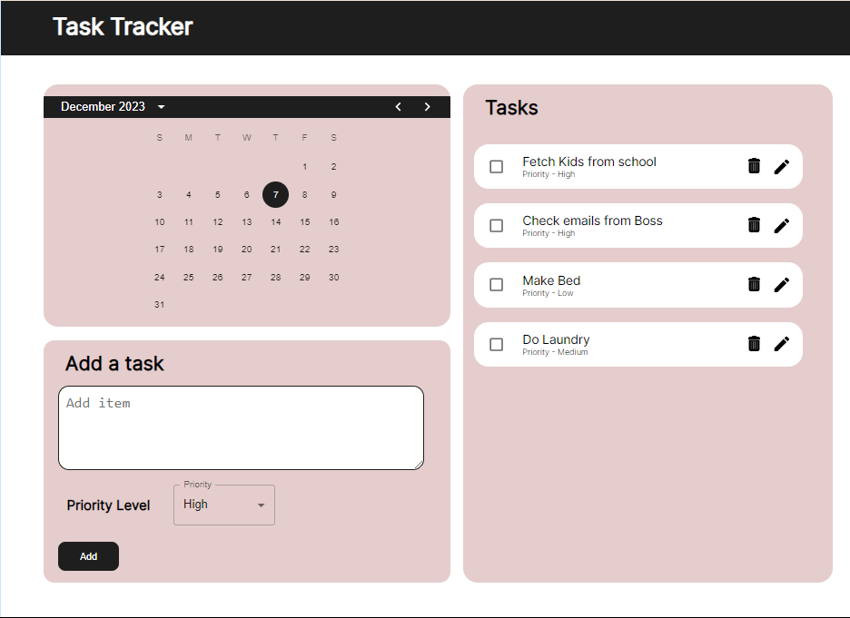

# ✨Task Tracker 📄📄

Welcome to Task Tracker, a simple and minimalist to do list application.
Created by Rehumile Sekoto and Sumaiya Mohammed👥, we collaborated together to bring to life a web app that allows you to track your task, add them to the list, edit if needed and remove them when complete.

## Key Features
 - ✨Minimalist design
 - 📅Calendar feature
 - 📝🗑️Edit and delete functionality
 - 🚩Identify tasks that need high, medium or low priority
 - ✨Responsive layout across multiple screen sizes.

## Technologies used
 - ReactJS with TypeScript
 - SCSS
 - Material UI
 - Dayjs
 - Node.js

  
## Design
[Figma Design](https://www.figma.com/file/SgpubXxVHJtfaLcnCZvRS2/Task-Tracker?type=design&node-id=0%3A1&mode=design&t=Ely1ijIgbE2TFaY1-1)

 

## Demo

[Click the link to view demo](https://vimeo.com/893854050?share=copy)
